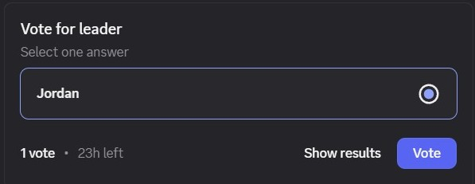
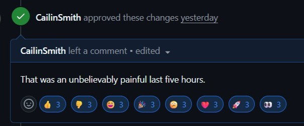

<div align="center">
  
</div>

## 📖 Description

GreensOnly is a C++ design pattern orientated system designed and built to simulate the different roles and activies in a nursery. You are able to participate as a customer, staff memebr or manager in our interactive system.


## 🚀 Getting Started

### Prerequisites

Before you begin, ensure you have the following installed:
- **g++** (C++17 compatible compiler)
- **cmake** (for building FTXUI)
- **git**
- **chafa** (for GUI image rendering)
- **valgrind** (optional, for memory checking)

#### Install on Ubuntu/Debian:
```bash
sudo apt-get install cmake g++ git build-essential chafa valgrind
```

### Installation

1. **Clone the repository:**
   ```bash
   git clone https://github.com/CailinSmith/COS214_Project_Classists.git
   cd COS214_Project_Classists
   ```

2. **Install dependencies (for GUI):**
   ```bash
   make install-deps
   ```
   *Note: This step is only required if you want to run the GUI interface. The CLI works without these dependencies.*

3. **Build the project:**
   ```bash
   make all
   ```
   Or build only the CLI:
   ```bash
   make
   ```

### Running the Application

The system provides two interactive interfaces:

- **CLI (Command Line Interface):**
  ```bash
  make runcli
  ```
  Text-based command-line interaction
  *Requires: g++ only*

- **GUI (Terminal-Based Graphical Interface):**
  ```bash
  make rungui
  ```
  Visual terminal interface with interactive menus and graphics powered by FTXUI  
  *Requires: FTXUI dependencies (run `make install-deps` first)*

### Additional Commands

**Building:**
- `make` - Build CLI only (default, no FTXUI needed)
- `make all` - Build everything: CLI and GUI
- `make gui` - Build GUI only (without running)

**Testing:**
- `make test` - Run unit tests
- `make itests` - Run integration tests

**Cleanup:**
- `make clean` - Remove build files
- `make clean-all` - Remove build files and dependencies

**Help:**
- `make help` - Show all available commands with detailed information

## The Team: Classists

| Profile | Name | Student number | Role |
|---------|------|------|------|
|  | Jordan Naidoo | u24664155 | Group Dictator |
|  | Cailin Smith | u24570525 | CLM (Command line master) |
|  | Alex Lange | u24587312 | [Role] |
|  | Edwin Kusel | u24670058 | [Role] |
|  | Abhay Rooplall | u24568792 | [Role] |

---

<div align="center">
  <strong>🌱 Thanks for checking our project out! 🌱</strong>
</div>
